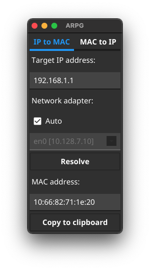

ARPG
====

A simple ARP (Address Resolution Protocol) support tool written in Go programming language.

## Key features

- Resolve MAC address from IP address
- Resolve IP address from MAC address
- Works on Windows, macOS and Linux

## Download

See [releases](https://github.com/mikan/arpg/releases) page.

## How it works

### IP to MAC

1. Check available network adapter information (e.g. eth0)
2. Send ICMP ping to the target using native `ping` command
3. Lookup ARP table using native `arp` (`ip`) command

### MAC to IP

1. Check available network adapter information (e.g. eth0)
2. Send ICMP ping to the *broadcast* address using native `ping` command
3. Lookup ARP table using native `arp` (`ip`) command

## Limitations

- Works only within a local area network
- IPv6 is not supported

## License

ARPG licensed under the [BSD 3-Clause License](LICENSE).

## Author

- [mikan](https://github.com/mikan)
